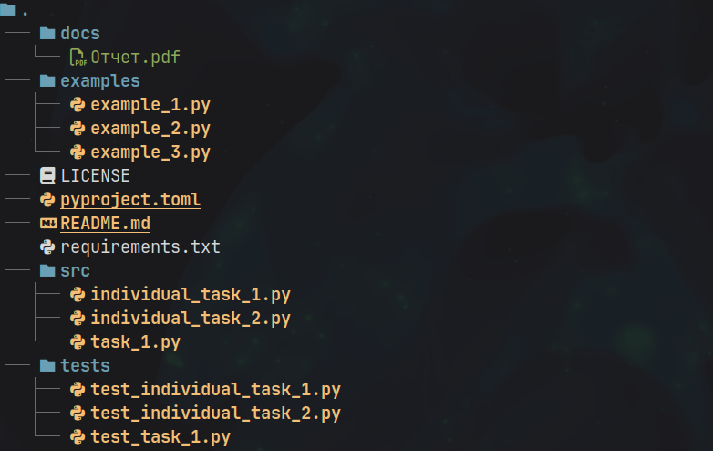

# Лабораторная работа №4 (4.3)
**Предмет** Объектно-ориентированное программирование  
**Тема:** Наследование и полиморфизм в языке Python 
**Вариант:** 8  

## Содержание

1. [Описание работы](#цель-работы)  
2. [Ссылка на отчет](#ссылка-на-отчет)  
3. [Структура репозитория](#структура-репозитория)  
4. [Задания](#задания)  

---

## Цель работы

Приобретение навыков по созданию иерархии классов при написании программ с помощью языка программирования Python версии 3.x.

---

## Ссылка на отчет

[Отчет о выполнении лабораторной работы](docs/Отчет.pdf)

---

## Структура репозитория

- `docs/` — отчет по лабораторной работе
- `examples/` — примеры из лабораторной работы  
- `src/` — исходный код программы
- `tests/` — pytests
- `pyproject.toml` - конфигурация проекта
- `requirements.txt` — список зависимостей

---

## Задания

### Задание №1
[Исходный код задания](src/task_1.py)

Разработайте программу по следующему описанию. В некой игре-стратегии есть солдаты и герои. У всех есть свойство, содержащее уникальный номер объекта, и свойство, в котором хранится принадлежность команде. У солдат есть метод "иду за героем", который вкачестве аргумента принимает объект типа "герой". У героев есть метод увеличения собственного уровня. В основной ветке программы создается по одному герою для каждой команды. В цикле генерируются объекты-солдаты. Их принадлежность команде определяется случайно. Солдаты разных команд добавляются в разные списки. Измеряется длина списков солдат противоборствующих команд и выводится на экран. У героя, принадлежащего команде с более длинным списком, увеличивается уровень. Отправьте одного из солдат первого героя следовать за ним. Выведите на экран идентификационные номера этих двух юнитов.

### Индивидуальное задание №1
[Исходный код задания](src/individual_task_1.py)

Составить программу с использованием иерархии классов. Номер варианта необходимо получить у преподавателя. В раздел программы, начинающийся после инструкции if __name__ = '__main__': добавить код, демонстрирующий возможности разработанных классов.
Создать класс Triangle с полями-сторонами. Определить методы изменения сторон, вычисления углов, вычисления периметра. Создать производный класс RightAngled (прямоугольный), имеющий поле площади. Определить метод вычисления площади.

### Индивидуальное задание №2
[Исходный код задания](src/individual_task_2.py)

В следующих заданиях требуется реализовать абстрактный базовый класс, определив в нем абстрактные методы и свойства. Эти методы определяются в производных классах. В базовых классах должны быть объявлены абстрактные методы ввода/вывода, которые реализуются в производных классах. Вызывающая программа должна продемонстрировать все варианты вызова переопределенных абстрактных методов. Написать функцию вывода, получающую параметры базового класса по ссылке и демонстрирующую виртуальный вызов.
Создать абстрактный базовый класс Function (функция) с виртуальными методами вычисления значения функции y=f(x) в заданной точке x и вывода результата на экран.Определить производные классы Ellipse (эллипс), Hyperbola (гипербола) с собственными функциями вычисления у в зависимости от входного параметра x. Уравнение эллипса: (x^2/a^2)+(y^2/b^2)=1; гиперболы: (x^2/a^2)-(y^2/b^2)=1.
